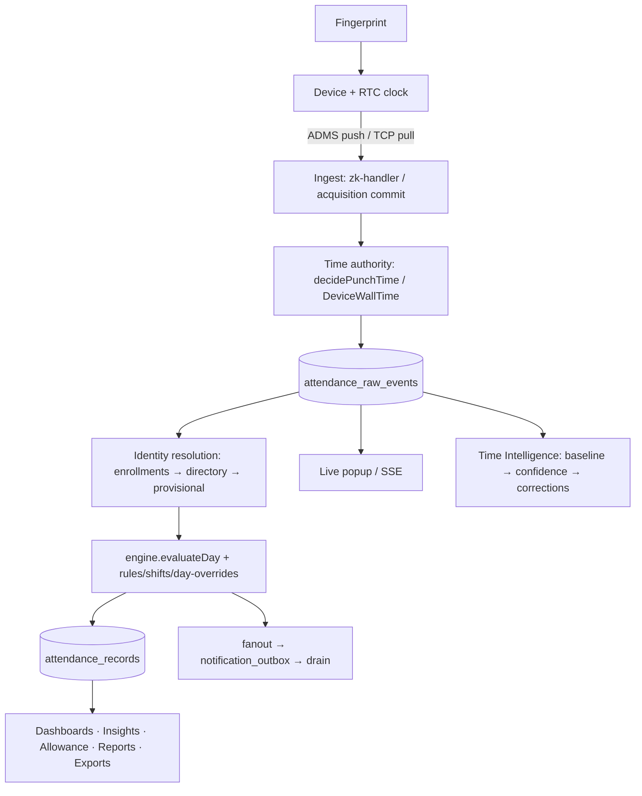

# Attendance Architecture Audit (Phase 0)

**Baseline for the Attendance Intelligence Program.** Version at audit: 1.80.104 · Date: 2026-07-23.
Every subsequent minor release (1.81.0 →) is measured against this inventory.

---

## 1. Canonical data stores

| Table | Role | Written by | Read by |
|---|---|---|---|
| `attendance_raw_events` | **Canonical punch store.** `punch_at` = corrected UTC instant; `device_reported_time` = verbatim device wall time (dedup identity, never rewritten); `ingested_at` = server receive; `clock_skew_seconds`, `time_source`, `time_confidence`; identity columns (`person_id`, `role_type`, `role_ref_id`, `matched`, `display_name`) | ADMS push (`zk-handler`), TCP acquisition commit, backfills | history API, dashboards, engine, exports, time-intelligence |
| `attendance_records` | **Day verdicts** (present/late/absent/half_day…) per (person, date). Single source of attendance truth | `engine.evaluateDay` only | allowance, insights, dashboards, reports |
| `attendance_rules` | Arrival windows, grace, weekday_mask; role-scoped; specificity: role beats `applies_to='all'` | settings API | engine, dashboard-counts, allowance |
| `attendance_rule_day_overrides` | Per-weekday overrides ("Saturday ends 10:00") | settings API | `day-overrides.ts` merge (engine, counts, allowance) |
| `attendance_daily_aggregates` | Rollups | aggregates job | reports |
| `biometric_enrollments` | PIN → person mapping (1:1 both ways, guarded) | enrollment-service, identity-matching confirm | live-scan resolution, verify flows |
| `device_user_directory` | Device's own user list (name/card/priv per PIN); `uk_dud(device_sn, device_user_id)` | TCP inventory, ADMS OPERLOG | identity matching, history name fallback |
| `biometric_match_suggestions` | Tiered auto/review/unmatched suggestions (`match_rank` — `rank` is reserved in TiDB) | `runDeviceUserMatching` | identity-matching UI |
| `attendance_acquisitions` + `_records` | TCP pull staging (status: pulling→staged→validated→committed) | acquisition service | device-control wizard, commit |
| `attendance_time_baselines` | Learned per-device fingerprint (median first-arrival, MAD…) | `learnBaseline` | confidence engine |
| `device_clock_health` | Per device-day time confidence/status | `evaluateDeviceDay` | Time Health page, badges |
| `attendance_time_corrections` | Batch corrections w/ original `punch_at` JSON (undo) | `applyCorrection` | Time Health history |
| `notification_policies` / `notification_outbox` / `notification_deliveries` | Shared SMS pipeline (queue → drain → provider) | fanout, passouts, attendance SMS | drainer, logs UI |
| `devices` | Registry: `sn`, `lan_ip`, `is_online`, `last_seen`, `device_type`, `passout_enabled` | heartbeat/handlers | everything device-scoped |
| `holidays`, `staff_shifts`(+assignments) | Calendar + shift schedules | respective UIs | engine (shift-as-rule beats school rule) |
| **Legacy (retired reads)**: `zk_attendance_logs`, `zk_user_mapping` | kept for history; dashboards/history no longer read them | — | migration/backfill only |

## 2. Service modules (`src/lib/`)

- **attendance/**: `engine.ts` (evaluateDay — THE verdict authority), `rule-evaluator.ts` (pure), `day-overrides.ts`, `dashboard-counts.ts`, `allowance.ts`, `policy-resolver.ts`, `device-clock.ts` (`resolveTimePolicy`, `decidePunchTime`), `adms-protocol.ts` (pure parser), `raw-event-backfill.ts` (retro-claim; person_id bug fixed v1.80.99), `provisional.ts`, `shifts.ts`/`staff-shift.ts`, `aggregates.ts`, `report-builder.ts`, `export/*`
- **attendance/acquisition/**: `wall-time.ts` (DeviceWallTime — wall↔UTC exactly once, TZ-invariant), `service.ts` (TCP pull), `validate.ts`, `commit.ts` (pure plan)
- **attendance/time-intelligence/**: `confidence.ts` (pure assessBatch), `engine.ts` (baselines, sweep, preview/apply/undo), `schema.ts`
- **biometric/**: `identity/matching.ts` (pure scorer 90/60 tiers), `identity/device-user-sync.ts` (run/confirm/reject + retro-claim), `enrollment-service.ts` (upsert w/ 1:1 guards), `device-access.ts` (ZK TCP; key=userId not uid), inventory/reconciliation/pin-allocator/template services
- **notifications/**: `fanout.ts` (policy→outbox), `drain.ts` (opportunistic drainer — **no cron**; nudged on enqueue)
- **passouts/**: gate engine on the live-scan hot path (see `docs/audits/` passout notes)

## 3. API surface (`/api/attendance/*` + related)

`history` (logs table: filters, tabs, sort, timeframes) · `live-scan` (hot path: resolve→evaluate→popup payload; gate decision on gate devices) · `stream` (SSE live feed) · `logs/delete` · `settings` (+day_overrides) · `insights` · `time-health` (sweep/preview/apply/undo/relearn) · `time-policy` · `identity-matching` · `allowance-report` · `shifts` · `acquisitions` (staging wizard) · `zk`/`zk-tcp`/`dahua` (device protocols) · `devices/*` (incl. per-PIN commands) · `enrollment-station` · `export` · `stats`/`summary`/`unified` · plus `/api/zk-handler` (ADMS ingest), `/api/dashboard/overview`, `/api/passouts/*`, `/api/staff?search=`.

## 4. UI surface (`/attendance/*` + related)

`logs` (operational home: data-first table, clock-health badges, anomaly banner, allowance, detect&map) · `time-health` · `identity-matching` · `settings` (windows + weekday overrides) · `shifts` · `devices` / `device-control` (pull wizard) / `device-logs` / `commands` · `enrollment` / `biometric` / `mapping` · `holidays` · `remote-features` · dashboard (role cards, insights, clock badges) · `/passouts` + `/passouts/gate`.

## 5. Integrations & runtime

- **ADMS push** (`zk-handler`): devices POST ATTLOG/OPERLOG over HTTP; works on Vercel. Store-and-forward: offline devices batch-upload later (this is why `ingested_at` ≠ punch instant).
- **LAN TCP** (`device-access.ts`, port 4370): inventory, user CRUD, time-set; only from LAN-connected runtimes (founder machine / on-prem), NOT Vercel lambdas.
- **SSE** `attendance/stream` for the live feed; the event bus does **not** cross Vercel lambdas (popup latency is ingest+poll bound).
- **Electron/Capacitor**: same Next.js app; Android = Capacitor 8 + nodejs-mobile (see android-build memory); no attendance-specific native code paths.
- **Background work**: NO standing cron. Patterns: opportunistic drains (outbox), lazy sweeps on read (passout sweep, time-health sweep, baseline 24h refresh), promise-gated runtime schema ensures. Vercel = request-scoped only.

## 6. Dependency flow (canonical punch lifecycle)

## 7. Technical debt (carried into the program)

1. `zk_attendance_logs` still written by some legacy paths — double-write until fully retired.
2. `attendance_records.status` lacks explicit per-stage trace (Phase 2 target: digital twin stages).
3. No per-record confidence surfaced (Phase 3).
4. Recovery after ingest gaps is manual (scripts/wizard) — Phase 5 target.
5. Health knowledge scattered (devices page, time-health, outbox) — Phase 1 target unifies.
6. `getPassout`/some list queries N+1-ish; acceptable at current scale.
7. Test data residue: one ZKTEST phantom raw event (school 12005, id 306863).

## 8. Founder-dependence baseline (measured before Phase 1)

| Workflow | Status at 1.80.104 |
|---|---|
| Clock drift detect+repair | **Automated** (Time Intelligence, v1.80.103–104) |
| Identity mapping | **Assisted** (Detect & map, review queue) |
| Attendance stop diagnosis | **Founder** — requires SQL/scripts → Phase 1/5 |
| SMS failure diagnosis | **Founder** — outbox SQL → Phase 1 |
| Why-is-this-late explanation | **Founder** — reads engine code → Phase 9 |
| Bulk recovery (missed days) | **Founder** — tmp scripts → Phase 5 |
| Device maintenance signals | **Partial** (clock health only) → Phase 7 |

Re-measure this table at every phase close.
